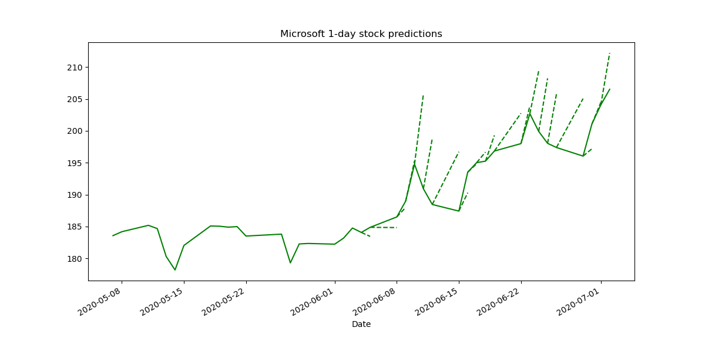

# Stock prediction

## Description
The goal of this project is to predict the value of a stock for the next day in hopes of maybe simulating a trading algorithm. I chose to use the average of the High and Low values for the stock to train a LSTM model, working only on 3 stocks for now and to analyze the problems which arise.

## Results
Here we can see an example of the next day predictions for 3 stocks.
Parameters : using the last 20 days as input sequence for the predictions, 25 epochs of training, 200 hidden neurons for the LSTM

- Amazon RMSE : 61.98837186223845
- Apple RMSE : 8.299626607550193
- Microsoft RMSE : 6.541609455255556

We see that the model can predict the next day's mean stock value pretty well for some stocks (i.e. low error), but what is more important to us is that we don't predict it to go up when it goes down.

If we only take the binary result of up or down from this model, we get these results :
Amazon : 6 wrong predictions out of 20
Apple : 9 wrong predictions out of 20
Microsoft : 9 wrong predictions out of 20

Even though the results seem okay when seen like this, these results don't have much value. For example, we can see that we always predict an increase for the Amazon stock.

## Current work
I am trying to see if I can find a correlation between google searches for specific keywords and the value of a stock. For example, if the days after searches for the name of the company and the word "scandal" increase, the stock might go down since people might tend to sell.
In reality, it is more complicated than this because these obvious searches reveal trends that are already taken into account by traders.

I am also trying to use the differenced dataframe to train the network, which may lead to a better result in the binary task of predicting "up" or "down" for the next day and would eliminate the need for smoothing windows.

## Further work
- Try building a binary classification model (i.e. only predicting "up" or "down")
- Try using different stocks
- Tune hyperparameters (hidden layer size, input sequence length, training epochs, learning rate, etc.)
- Try a different LSTM architecture (for example 2 hidden layers)
- Clean code
- Find a way to figure out how sure the model is of its prediction

